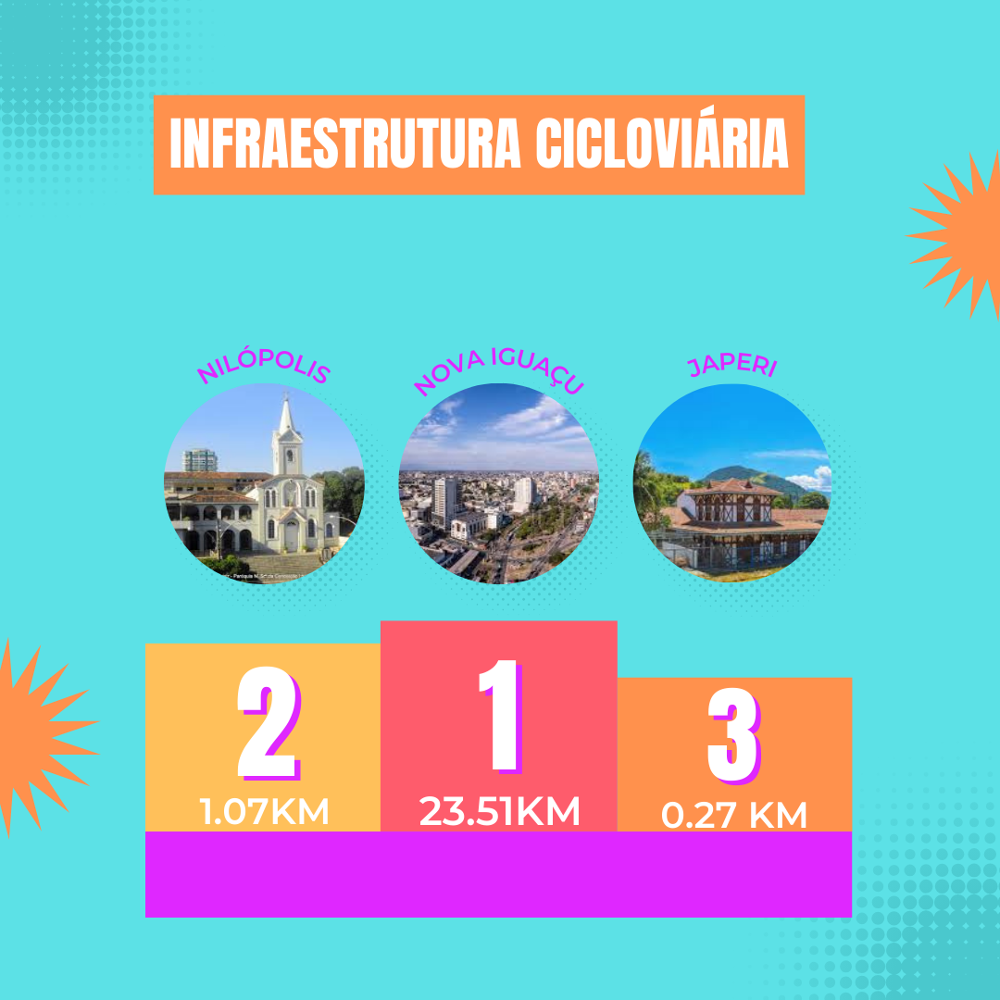

# Extensão da rede cicloviária

## Japeri

    A cidade de Japeri, das três analisadas tem a menor malha cicloviária contendo apenas    de extensão pela cidade.
## Nova Iguaçu
    Na cidade de Nova iguaçu tem a maior malha cicloviária das três cidades analisadas, contendo 23.51KM de extensão sendo mais de 87 vezes maior do que o muniípio de Japeri.

## Nilópolis
    Na cidade de Nilópolis, existe 1.07 KM de malha cicloviária.